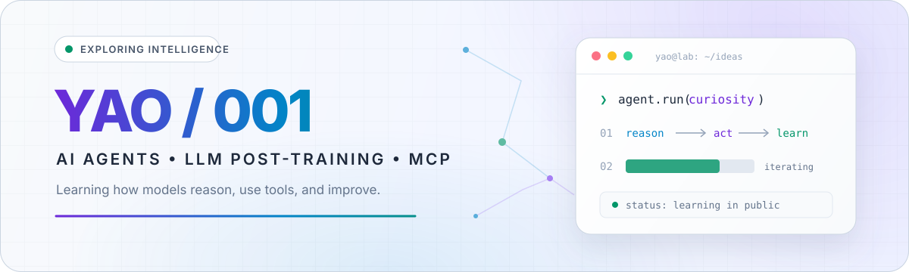

<picture>
  <source media="(prefers-color-scheme: dark)" srcset="./assets/hero-dark.svg">
  <source media="(prefers-color-scheme: light)" srcset="./assets/hero-light.svg">
  
</picture>

  
  
  

<h2 align="center">Hi, I'm YAO 👋</h2>

  I’m exploring how large language models <strong>learn, reason, and act</strong>. 
  我正在探索 AI Agent、LLM 后训练与 MCP 生态，并用 Python 把想法变成实验。

## Current focus

<table>
  <tr>
    <td width="33%" valign="top">
      <h3 align="center">🤖 Agent Systems</h3>
      
Learning orchestration, tool use, memory, and the engineering patterns behind dependable AI applications.

      
<a href="https://github.com/YAO-001/trpc-agent-python"><code>trpc-agent-python</code></a>

    </td>
    <td width="33%" valign="top">
      <h3 align="center">🧠 LLM Post-training</h3>
      
Studying reinforcement-learning workflows, scalable training infrastructure, and agent-oriented model optimization.

      

        <a href="https://github.com/YAO-001/trl"><code>TRL</code></a> ·
        <a href="https://github.com/YAO-001/verl"><code>VERL</code></a> ·
        <a href="https://github.com/YAO-001/AReaL"><code>AReaL</code></a>
      

    </td>
    <td width="33%" valign="top">
      <h3 align="center">🔌 MCP Ecosystem</h3>
      
Exploring clean ways to connect models with tools, context, and real-world services through open protocols.

      
<a href="https://github.com/YAO-001/fastmcp"><code>FastMCP</code></a>

    </td>
  </tr>
</table>

## Toolbox & interests

  
  
  
  
  
  
  

> My public forks are a working library of projects I’m reading, reproducing, and learning from. Original experiments and notes will appear here as they mature.

 

  

Curiosity → experiments → understanding.

<!--
Maintenance note:
- Keep the focus cards honest and current.
- Replace the learning-library note with a "Featured projects" section after publishing original work.
- Pin 3–6 repositories that best support the story told above.
-->
